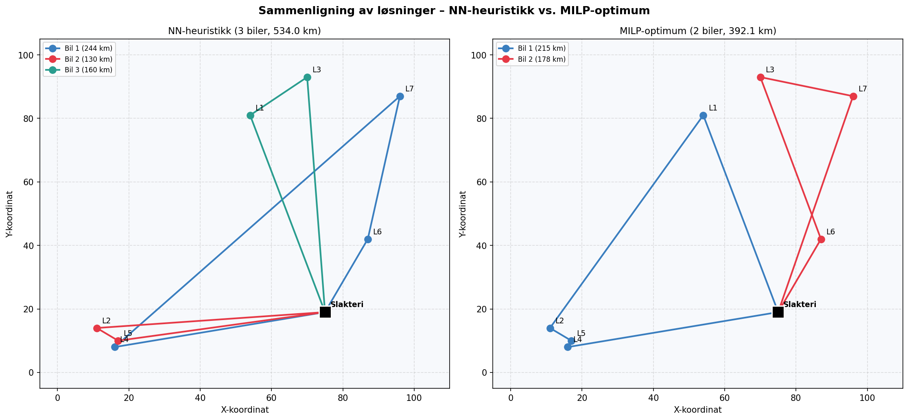
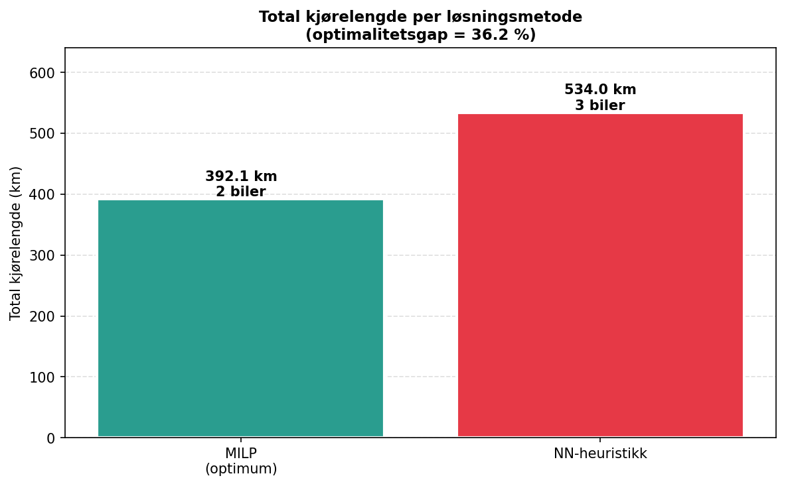
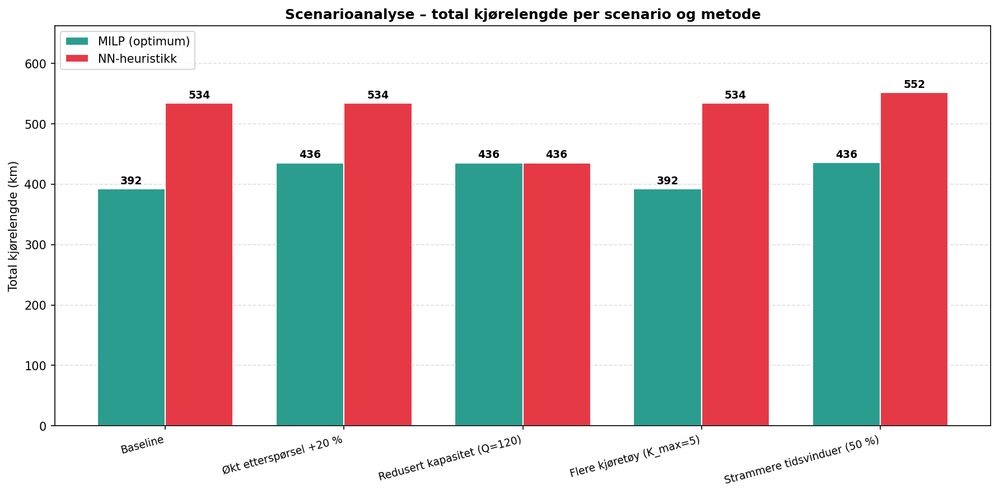

# Sammendrag

*[Skrives etter peer-review.]*

# Abstract

*[To be written after peer review.]*

## 1.0 Innledning
Fortransport av slakteklar fisk fra oppdrettslokaliteter til slakteri er en sentral logistikkaktivitet i oppdrettsnæringen. Effektiv ruteplanlegging har stor betydning for transportkostnader, kjøretid, kapasitetsutnyttelse og miljøpåvirkning. Små forbedringer i rutevalg og planlegging kan gi betydelige gevinster, særlig i regioner med mange lokaliteter og varierende transportavstander. Samtidig er ruteplanlegging et komplekst beslutningsproblem som egner seg godt for kvantitative modeller og KI-støttet analyse. 

Denne oppgaven tar utgangspunkt i fortransport i én region hos Lerøy og undersøker hvordan ruteplanlegging kan modelleres og analyseres ved hjelp av kvantitative metoder. Studien er avgrenset til transport fra 7 oppdrettslokaliteter til ett slakteri og fokuserer på kostnadsminimering som beslutningskriterium. 

## 1.1 Problemstilling
Hvordan kan kvantitative ruteplanleggingsmodeller, støttet av kunstig intelligens, bidra til mer effektiv fortransport av slakteklar fisk i én region hos Lerøy? 

**Forskningsspørsmål:**
1. Hvordan kan fortransporten modelleres som et ruteplanleggingsproblem (Vehicle Routing Problem) basert på tilgjengelige data om lokasjoner, avstander og transportvolumer? 

2. Hvilke ruter gir lavest samlet transportkostnad sammenlignet med en enkel referanseløsning (baseline)? 

3. Hvordan påvirkes den optimale ruten av endringer i transportvolum og antall oppdrettslokaliteter innenfor gitte rammebetingelser?

## 1.2 Avgrensinger
For å gjøre problemstillingen håndterbar er oppgaven avgrenset på flere områder. For det første er analysen begrenset til én region og ett slakteri (depot), med tilhørende syv oppdrettslokaliteter. Dette innebærer at problemstillingen ikke tar hensyn til samspill mellom flere depoter eller større geografiske nettverk. Avgrensningen er gjort for å isolere effekten av rutevalg og gjøre modellen håndterbar. 

For det andre fokuserer oppgaven på et statisk ruteplanleggingsproblem. Det innebærer at planleggingen gjøres én gang ut fra kjente inputdata, uten sanntidsoppdatering eller reoptimalisering underveis i et oppdrag. Dette er gjort for å kunne analysere problemet innenfor VRP-rammen. 

Oppgaven er også avgrenset til én type kjøretøy med fast kapasitet. Variasjoner i kjøretøystyper, kostnadsstrukturer eller bemanning er ikke inkludert. Dette forenkler modelleringen og gjør det mulig å fokusere på selve rutestrukturen. 

Når det gjelder løsningsmetode benytter oppgaven to komplementære tilnærminger: en eksakt MILP-formulering som gir en referanseoptimal løsning, og en greedy nearest-neighbor-heuristikk som representerer en operasjonelt enkel og transparent metode. Sammenligningen mellom de to gjør det mulig å kvantifisere heuristikkens kvalitet opp mot det matematiske optimum. Mer avanserte metaheuristikker (f.eks. tabu search, genetiske algoritmer eller læringsbaserte metoder) er utenfor prosjektets omfang. 

## 1.3 Antagelser
Avgrensingene over beskriver hva som er valgt inn og ut av modellen. I tillegg er det gjort flere forenklede antagelser om forhold som faktisk inngår i modellen, men som er representert på en forenklet måte. Vi erkjenner at dette påvirker hvor realistiske resultatene blir. 

1. Det antas at avstanden mellom lokasjoner er oppgitt euklidisk basert på koordinater, som i praksis betyr at transporten går gjennom en rett linje i terrenget mellom to punkter, og ikke et faktisk veinett. Konsekvensen av dette er at modellen ikke representerer reell kjørelengde og reisetid. 

2. Det antas at kjørehastigheten mellom to lokasjoner er konstant, slik at reisetid er direkte proporsjonal med avstand. Det innebærer at variasjoner i trafikkforhold, vær eller infrastruktur ikke tas hensyn til, som vil påvirke modellens realisme. 

3. Det forutsettes at alle data er deterministiske og kjente på forhånd. Etterspørsel, tidsvinduer og lastetider er dermed faste vinduer uten usikkerhet. I en virkelig verden endrer slike parameter seg kontinuerlig, noe som betyr at modellen ikke kommer til å vise operasjonell usikkerhet. 

Disse antakelsene innebærer at modellen representerer en forenklet versjon av 

virkeligheten, men det gjør det mulig for oss å analysere strukturen i 

ruteplanleggingsproblemet. Resultatet av denne analysen kan dermed ikke overføres til reelle operasjoner. 

## 2.0 Litteratur
De siste fem årene har litteraturen om Vehicle Routing Problem (VRP) vært preget av tre tydelige utviklingstrekk: økt vekt på mer realistiske problemvarianter, fortsatt sterk bruk av heuristikker, og økende interesse for maskinlæring og KI-baserte løsningsmetoder. Samtidig viser nyere oversiktsartikler at det klassiske kapasitetsbegrensede VRP fortsatt er et sentralt utgangspunkt, men at forskningen i økende grad retter seg mot varianter med tidsvinduer, dynamiske forhold og bærekraftshensyn. Archetti et al. (2026) beskriver hvordan nyere VRP-forskning i større grad fokuserer på varianter og utvidelser som gjør modellene mer anvendelige i praksis, fremfor kun å studere den klassiske basisversjonen. Dette er relevant for denne oppgaven, siden fortransport av slakteklar fisk ikke bare handler om å minimere avstand, men også om å håndtere operative begrensninger som kapasitet og tid. 

Et sentralt bidrag i nyere litteratur er derfor studier av tidsavhengige og tidsbegrensede ruteproblemer. Adamo et al. (2024) viser at feltet de siste årene har hatt viktige metodiske fremskritt innen tidsavhengig VRP, blant annet gjennom bedre håndtering av reisetid, sanntidsreoptimalisering og mer avanserte løsningsmetoder. Selv om denne oppgaven ikke modellerer sanntidsendringer i veinett eller trafikk, er litteraturen likevel relevant fordi den understreker at tid er en kritisk dimensjon i moderne ruteplanlegging. Vår oppgave ligger dermed nærmere denne forskningsretningen enn en ren, klassisk CVRP-modell, ettersom tidsmatrise, tidsvinduer og maksimal rutevarighet inngår som sentrale begrensninger. 

Et annet tydelig trekk i forskningen er at heuristikker fortsatt står sterkt som praktisk løsningsstrategi. Liu et al. (2023) viser at heuristikker og metaheuristikker fortsatt er blant de mest brukte tilnærmingene i VRP-forskning, nettopp fordi de gir gode løsninger med akseptabel beregningstid når problemene blir store og komplekse. Oversikten fremhever også at nyere forskning i stor grad bygger videre på slike tilnærminger, heller enn å erstatte dem fullstendig. Dette støtter valg av metode i denne rapporten. Oppgaven søker ikke å bevise en globalt optimal løsning gjennom en eksakt metode, men å utvikle en gjennomførbar og faglig relevant modell for et avgrenset transportproblem. Den greedy-baserte nearest neighbor-heuristikken som benyttes her, er derfor i tråd med en etablert retning i litteraturen, hvor beregningseffektivitet og operasjonell anvendbarhet vektlegges. 

Samtidig viser nyere litteratur at maskinlæring og KI får en stadig større plass i VRP-feltet. Bogyrbayeva et al. (2024) gir en systematisk oversikt over læringsbaserte metoder og viser at det de siste årene har vært sterk vekst i forskning som kombinerer maskinlæring med 

5 

tradisjonelle heuristikker og optimeringsmetoder. Et viktig poeng i denne litteraturen er at læringsbaserte metoder ikke nødvendigvis erstatter klassiske metoder, men ofte brukes som støtte for bedre beslutninger, raskere søk eller forbedret generalisering. For denne oppgaven er dette særlig relevant fordi prosjektet er plassert i skjæringspunktet mellom logistikk og KI-støttet analyse. Rapporten benytter ikke maskinlæring som selve løsningsmetoden, men forholder seg til denne utviklingen ved å bruke en tradisjonell heuristisk modell som et transparent og forståelig utgangspunkt. Dermed plasserer oppgaven seg i et faglig landskap hvor enkle, forklarbare modeller fortsatt har verdi, særlig i tidlige analyser og avgrensede case. 

En tredje utvikling i nyere VRP-litteratur er koblingen til bærekraft og bredere logistiske hensyn. Liu et al. (2023) viser i sin systematiske litteraturgjennomgang at VRP i økende grad brukes i sammenhenger der miljømessige, økonomiske og operasjonelle hensyn må ses i sammenheng. Selv om denne oppgaven først og fremst fokuserer på transportkostnad og gjennomførbarhet, er dette relevant fordi mer effektiv ruteplanlegging også kan gi indirekte gevinster i form av redusert kjørelengde og bedre ressursutnyttelse. Rapporten bidrar ikke primært til bærekraftslitteraturen, men står i forlengelsen av denne ved å undersøke hvordan bedre planlegging kan gi mer effektive transporter i en havbrukskontekst. 

Samlet viser litteraturen de siste fem årene at VRP-forskningen beveger seg mot mer realistiske, sammensatte og anvendte problemstillinger. Denne rapporten forholder seg til denne utviklingen ved å modellere et kapasitets- og tidsbegrenset ruteproblem inspirert av fortransport i havbruksnæringen. Samtidig avgrenser oppgaven seg bevisst fra de mest avanserte metodene i nyere forskning, som dype læringsmodeller og komplekse metaheuristikker, og velger i stedet en enklere heuristisk tilnærming. Dette gjør analysen mindre avansert metodisk, men til gjengjeld mer transparent, etterprøvbar og godt tilpasset prosjektets omfang og formål. 

## 3.0 Teori
## 3.1 Vehicle Routing Problem (VRP)
Vehicle Routing Problem (VRP) er et sentralt optimaliseringsproblem innen logistikk og transportplanlegging, først formulert av Dantzig og Ramser (1959). Problemet omhandler hvordan en flåte av kjøretøy kan planlegges slik at et sett av lokasjoner betjenes med lavest mulig kostnad, ofte uttrykt som total kjørelengde eller transporttid (Toth & Vigo, 2014). 

VRP er klassifisert som et NP-hard problem, noe som innebærer at beregningskompleksiteten øker raskt med antall lokasjoner (Laporte, 2009). Dette gjør at eksakte løsninger ofte er upraktiske i realistiske anvendelser. 

Nyere forskning viser at VRP ikke lenger primært studeres som et rent teoretisk problem, men som et rammeverk for å modellere komplekse, virkelige logistikkproblemer. Ifølge Archetti et al. (2026) har utviklingen de siste årene gått i retning av mer anvendte og realistiske problemformuleringer, hvor flere restriksjoner og operasjonelle hensyn inkluderes. 

Dette er direkte relevant for denne oppgaven, hvor ruteplanlegging ikke kun handler om avstand, men også om kapasitet, tidsvinduer og operasjonell gjennomførbarhet i en havbrukskontekst. 

7 

## 3.2 VRP med tidsvinduer (VRPTW)
Vehicle Routing Problem with Time Windows (VRPTW) er en utvidelse av VRP hvor hver lokasjon må betjenes innenfor et gitt tidsintervall (Solomon, 1987). Dette gjør modellen mer realistisk, men også betydelig mer kompleks. 

Nyere studier understreker at tidsdimensjonen har blitt en av de viktigste faktorene i 

moderne ruteplanlegging. Adamo et al. (2024) viser at utviklingen innen VRP i stor grad handler om å håndtere tidsavhengige forhold, inkludert tidsvinduer, dynamiske endringer og koordinering av ressurser. 

I denne oppgaven modelleres tidsvinduer og maksimal rutevarighet eksplisitt, noe som plasserer problemstillingen nær VRPTW-litteraturen. Dette er særlig relevant i fortransport av fisk, hvor logistiske prosesser er tidskritiske og må koordineres med videre produksjon. VRPTW innebærer derfor en avveining mellom: 

- transportkostnad 

- kapasitetsutnyttelse 

- tidsmessig gjennomførbarhet 

## 3.3 Eksakte metoder og heuristikker
Løsningsmetoder for VRP kan deles inn i eksakte metoder og heuristikker (Toth & Vigo, 2014). 

Eksakte metoder gir optimale løsninger, men er beregningstunge og lite skalerbare. Dette gjør dem ofte uegnet for praktiske problemstillinger med mange lokasjoner eller komplekse restriksjoner. 

Heuristikker og metaheuristikker er derfor mye brukt i praksis. Ifølge Liu et al. (2023) er 

heuristiske metoder fortsatt dominerende i VRP-forskning, nettopp fordi de gir gode løsninger med lav beregningstid. 

Dette samsvarer med utviklingen i nyere litteratur, hvor fokus har vært på: 

- forbedring av heuristikker 

- hybridmetoder 

- balansering av kvalitet og effektivitet 

I denne oppgaven er valget av en heuristisk metode derfor faglig forankret. Målet er ikke å 

finne en global optimal løsning, men en praktisk gjennomførbar og kostnadseffektiv 

løsning innenfor gitte rammebetingelser. 

## 3.4 Greedy heuristikk og nearest neighbor
8 

Greedy heuristikker bygger løsninger stegvis ved å velge det til enhver tid beste 

alternativet basert på et lokalt kriterium (Cormen et al., 2009). 

Nearest neighbor er en av de enkleste variantene, hvor neste lokasjon velges basert på kortest avstand fra nåværende posisjon. 

Denne metoden har flere fordeler: 

- lav beregningstid 

- enkel implementasjon 

- intuitiv struktur 

Samtidig har den klare begrensninger, særlig knyttet til at lokale valg ikke nødvendigvis gir globalt optimale løsninger. 

Likevel viser litteraturen at slike enkle heuristikker fortsatt har en viktig rolle, spesielt i avgrensede case og som baseline-modeller (Liu et al., 2023). 

I denne oppgaven benyttes en greedy nearest neighbor-heuristikk kombinert med kapasitets- og tidsrestriksjoner. Dette representerer en balansert tilnærming mellom modellens kompleksitet og praktisk anvendbarhet. 

## 3.5 Kunstig intelligens i ruteplanlegging
De siste årene har det vært økende interesse for bruk av kunstig intelligens i 

ruteplanlegging. Maskinlæring og læringsbaserte metoder brukes blant annet til: 

- prediksjon av etterspørsel 

- forbedring av heuristikker 

- raskere søk i løsningsrommet 

Bogyrbayeva et al. (2024) viser at læringsbaserte metoder i økende grad kombineres med 

tradisjonelle optimeringsmetoder, fremfor å erstatte dem fullstendig. 

I denne oppgaven benyttes ikke maskinlæring direkte i løsningsmetoden. Likevel er 

arbeidet relevant i en KI-kontekst, da det etablerer en modellstruktur som kan 

videreutvikles med mer avanserte metoder. 

Dermed plasserer oppgaven seg i skjæringspunktet mellom: 

- klassisk operasjonsanalyse 

- moderne, KI-støttet logistikk 

9 

## 3.6 Oppsummering og kobling til problemstilling
Litteraturen viser at moderne VRP-forskning beveger seg mot mer realistiske og anvendte problemstillinger, hvor tidsvinduer, kapasitetsbegrensninger og operasjonelle hensyn er sentrale. 

Samtidig understrekes det at heuristiske metoder fortsatt er avgjørende for å løse slike problemer i praksis, særlig når beregningstid og implementerbarhet er viktige faktorer. Denne oppgaven bygger på disse prinsippene ved å modellere fortransport som et kapasitets- og tidsbegrenset ruteproblem, løst ved hjelp av en greedy heuristikk. Valget av metode er i tråd med både klassisk teori og nyere forskning, og reflekterer en bevisst avveining mellom modellens realisme, kompleksitet og anvendbarhet. 

## 4.0 Casebeskrivelse
Denne oppgaven tar utgangspunkt i en case knyttet til transportoptimalisering hos Lerøy Seafood Group, en sentral aktør innen norsk havbruksnæring. Lerøy har omfattende logistikk knyttet til transport av fisk mellom produksjonslokaliteter og videre til mottak eller slakteri, og fortransport av slakteklar fisk er en av flere logistikkaktiviteter der effektiv ruteplanlegging kan gi betydelige gevinster. 

Caset setter søkelys på fortransporten fra oppdrettslokaliteter til slakteri. Fisken hentes ved lokalitetene etter avtalte tidsvinduer, og må leveres innenfor angitte tidsrammer for å ivareta kvalitet og driftsflyt på slakteriet. Denne delen av verdikjeden er kritisk fordi forsinkelser eller ubalansert kapasitetsbruk direkte påvirker transportkostnader, dyrevelferd og produktets ferskhet. 

Havbruksnæringen i Norge er preget av geografisk spredte anlegg langs kysten, med varierende avstander og transportforhold. Dette gjør ruteplanlegging til et sammensatt og løpende beslutningsproblem, og danner den bredere konteksten for oppgaven. 

Caset er avgrenset til én region og omfatter syv oppdrettslokaliteter og ett slakteri. Slakteriet fungerer som depot, der alle ruter starter og avsluttes. Kjøretøyene har en fast kapasitet på 180 enheter per bil, mens samlet etterspørsel i datasettet er 312 enheter. At etterspørselen overstiger kapasiteten til én bil gjør at flere ruter må planlegges samtidig. I tillegg er det definert tidsvinduer for henting ved hver lokalitet og en maksimal tillatt varighet per rute. 

Kombinasjonen av geografisk spredte lokaliteter, kapasitetsbegrensninger og tidsvinduer gjør caset godt egnet for modellering som et ruteplanleggingsproblem med tidsvinduer (VRPTW). Problemet er tilstrekkelig komplekst til å gi analytisk interesse, men samtidig avgrenset nok til å gi oversiktlige og etterprøvbare resultater innenfor oppgavens rammer. I denne rapporten benyttes et syntetisk datasett utviklet for analyseformål, mens Lerøy Seafood Group fungerer som casegrunnlag for problemstillingen.

## 5.0 Metode og data
## 5.1 Metode
## 5.1.1 Datagrunnlag
Datagrunnlaget i prosjektet er basert på et syntetisk, men konsistent datasett generert av faglærer. Datasettet representerer ett slakteri (depot) og sju oppdrettslokaliteter, og er utviklet for å gi et realistisk grunnlag for modellering av ruteplanlegging med kapasitetsog tidsbegrensninger. 

Datasettet består av koordinater for slakteri og lokaliteter, etterspørsel per lokalitet, lastetid per lokalitet, tidsvinduer for henting, avstandsmatrise, tidsmatrise og kapasitet på kjøretøy. Dette gir et samlet grunnlag for å analysere hvordan fortransporten kan organiseres mer effektivt. 

Bruken av syntetiske data gjør det mulig å utvikle og teste modellen i en kontrollert case, samtidig som dataene er tilstrekkelig realistiske til å belyse logistiske utfordringer knyttet til transport, kapasitet og tidsstyring. 

## 5.1.2 Lokasjoner og koordinater
Caset består av åtte noder totalt: ett slakteri og sju oppdrettslokaliteter. Slakteriet fungerer som depot, og alle ruter starter og avsluttes her. 

11 

|**Node**|**Rolle**|**x**|**y**|
|---|---|---|---|
|**0**|Slakteri|75|19|
|**1**|Lokalitet 1|54|81|
|**2**|Lokalitet 2|11|14|
|**3**|Lokalitet 3|70|93|
|**4**|Lokalitet 4|16|8|
|**5**|Lokalitet 5|17|10|
|**6**|Lokalitet 6|87|42|
|**7**|Lokalitet 7|96|87|

Koordinatene er oppgitt i et todimensjonalt koordinatsystem og brukes som grunnlag for beregning av avstander mellom lokasjonene. 

## 5.1.3 Avstandsmetode
Avstandene mellom slakteriet og lokalitetene ble beregnet som luftlinjeavstander basert på oppgitte x- og y-koordinater. Det ble brukt euklidsk avstand, som betyr den rette linjen mellom to punkter i et koordinatsystem. Dette er en vanlig og enkel forenkling i ruteplanleggingsmodeller når faktiske veidata ikke er tilgjengelige. 

I prosjektet forutsettes det at én enhet i koordinatsystemet tilsvarer én kilometer. Avstandene brukes videre som grunnlag for beregning av transportkostnader og som input til den heuristiske modellen. 

## 5.1.4 Avstandsmatrise
På bakgrunn av koordinatene ble det utarbeidet en avstandsmatrise som viser avstanden mellom alle lokasjoner i caset. Matrisen er symmetrisk, noe som betyr at avstanden fra node A til node B er den samme som fra node B til node A. Diagonalen i matrisen er lik 0, siden avstanden fra en lokasjon til seg selv er null. 

Avstandsmatrisen brukes i modellen for å beregne total kjørelengde og sammenligne alternative ruter. Full avstandsmatrise er lagt ved i vedlegg A. 

12 

## 5.1.5 Tidsmatrise
I tillegg til avstandsmatrisen ble det etablert en tidsmatrise. Tidsmatrisen er avledet fra avstandene og angir reisetid mellom lokasjonene i minutter. I dette prosjektet er tidsmatrisen basert på en forenkling der avstandene er omgjort til hele minutter. 

Tidsmatrisen brukes i modellen for å kontrollere om en rute er gjennomførbar innenfor gitte tidsvinduer, og om kjøretøyet rekker å returnere til depot innen maksimal tillatt tid. Full tidsmatrise er lagt ved i vedlegg B. 

## 5.1.6 Validering av avstander
For å sikre at avstandsmatrisen var korrekt, ble beregningene kontrollert på flere måter. For det første ble det kontrollert at diagonalen i matrisen er lik 0, og at matrisen er symmetrisk. For det andre ble utvalgte avstander kontrollregnet manuelt ved bruk av formelen for euklidsk avstand. 

Det var i utgangspunktet ønskelig å sammenligne avstandene med kart, men dette ble ikke gjennomført direkte. Årsaken er at prosjektet benytter syntetiske koordinater og ikke reelle geografiske lokasjoner eller veinett. En direkte sammenligning med faktiske kartdata ville derfor ikke vært faglig presis. I stedet er den valgte avstandsmetoden vurdert som en hensiktsmessig og konsistent forenkling for analyseformålet. 

## 5.1.7 Øvrige inputdata
Modellen bygger også på flere andre inputdata enn koordinater og avstander. For hver lokalitet er det definert etterspørsel, lastetid og tidsvindu. Kjøretøykapasiteten er satt til 180 enheter. Samlet etterspørsel i datasettet er større enn kapasiteten til ett kjøretøy, noe som gjør det nødvendig å analysere flere ruter og flere biler. 

Disse inputdataene er sentrale fordi de påvirker hvilke ruter som er mulige å gjennomføre. Selv om en rute kan være kort i avstand, kan den være urealistisk dersom kapasiteten overskrides eller tidsvinduene ikke kan overholdes. 

13 

## 5.2 Data
## 5.2.1 Identifisere lokasjoner
Som grunnlag for modellutviklingen ble det først gjennomført en systematisk identifisering av relevante lokasjoner i transportnettverket. Dette omfatter både oppdrettslokaliteter og slakteri, som til sammen utgjør nodene i modellen. Utvalget av lokasjoner er gjort med hensikt å representere et realistisk, men avgrenset transportproblem, tilpasset prosjektets omfang og tilgjengelige ressurser. 

## 5.2.2 Velge region
Datasettet representerer ikke en spesifikk geografisk region, men er konstruert for å etterligne realistiske transportforhold i havbruksnæringen. Avstander og lokasjonsstruktur er valgt slik at lokalitetene gir variasjon i rutevalg og transportavstander innenfor et plausibelt geografisk område. 

Denne tilnærmingen gir fleksibilitet i modellutviklingen og kontroll over sentrale variabler, men kan påvirke overførbarheten til reelle geografiske forhold. 

## 5.2.3 Identifisere oppdrettslokaliteter
Totalt inngår syv oppdrettslokaliteter i modellen, i tråd med prosjektets avgrensning. Hver lokalitet fungerer som en node med tilhørende transportbehov og tidsvindu. 

Ved generering av lokalitetene er det lagt vekt på geografisk spredning, slik at datasettet gir variasjon i avstander og rutevalg. Dette balanserer realisme og gjennomførbarhet, og skaper et analytisk interessant ruteplanleggingsproblem. 

14 

## 5.2.4 Identifisere slakteri
Slakteriet i modellen er også syntetisk generert og representerer et sentralt mottakspunkt for transporten. 

Slakteriet fungerer som depot i modellen, hvor alle ruter starter og avsluttes. Dette er i tråd med standard antagelser i Vehicle Routing Problem (VRP). 

Valget av ett slakteri bidrar til å forenkle modellstrukturen, samtidig som det gir et realistisk utgangspunkt for analyse av transport mellom oppdrettslokaliteter og mottaksanlegg. 

## 5.2.5 Finne koordinater
For hver node i datasettet er det definert x- og y-koordinater i et todimensjonalt koordinatsystem (se tabell i 5.1.2). Koordinatene er syntetisk generert og utgjør grunnlaget for beregning av avstander mellom alle noder i modellen. 

## 5.2.6 Kontrollere lokasjoner
For å sikre konsistens i datasettet ble lokasjonene kontrollert med hensyn til innbyrdes plassering og avstander. 

15 

Koordinatene er vurdert slik at de gir realistiske avstander mellom lokalitetene, og ingen lokasjoner er plassert på en måte som skaper urealistiske transportforhold. Kontrollen bidrar til å sikre at modellen opererer på et troverdig grunnlag. 

## 5.2.7 Strukturere datasett
De geografiske dataene ble strukturert i et tabellformat som er egnet for videre bruk i modellen. Datasettet inneholder følgende variabler: 

- node-ID 

- lokasjonstype (oppdrettslokalitet eller slakteri) 

- x-koordinat 

- y-koordinat 

Datastrukturen er utformet slik at den enkelt kan benyttes i Python for beregning av avstandsmatrise og videre modellimplementering. 

## 5.3 Genererte transportdata
For å kunne gjennomføre analysen ble det generert transportrelaterte data som beskriver etterspørsel og kostnadsstruktur i modellen. 

Disse dataene utgjør grunnlaget for hvordan transportproblemet modelleres, og påvirker både rutevalg og totale transportkostnader. 

## 5.3.1 Definere transportvolum
For hver oppdrettslokalitet ble det definert et transportvolum som representerer mengden fisk som skal transporteres til slakteriet. 

Transportvolumet er syntetisk generert, men tilpasset slik at det gir realistiske variasjoner mellom lokalitetene. Dette bidrar til å skape et mer representativt transportproblem, hvor kapasitet og rutevalg får betydning for løsningen. 

Volumet fungerer som etterspørsel i modellen, og danner grunnlaget for 

kapasitetsbegrensningene knyttet til hvert kjøretøy. 

16 

## 5.3.2 Definere kostnadsparametere
For å kunne evaluere ulike ruter er det definert en forenklet kostnadsstruktur i modellen. Transportkostnaden antas å være proporsjonal med kjørelengde mellom lokalitetene. Dette innebærer at lengre ruter gir høyere kostnad, uten at det gjennomføres detaljerte økonomiske beregninger. 

Denne forenklingen er vanlig i ruteplanleggingsproblemer og gjør det mulig å fokusere på optimalisering av rutestruktur fremfor komplekse kostnadsmodeller. 

Det er også definert en kapasitet for kjøretøyene, som begrenser hvor mye volum som kan transporteres per rute. 

## 5.4 Bruk av KI i metodeprosessen
I henhold til gjeldende retningslinjer for bruk av kunstig intelligens i studentarbeider dokumenteres det her hvordan generative språkmodeller er benyttet i prosjektet. 

Gruppen har brukt ChatGPT, Claude og Gemini som støtteverktøy gjennom metodeprosessen. Verktøyene er i hovedsak benyttet til idémyldring og strukturering av kapittelinndeling og argumentflyt, litteratursøk og utarbeiding av teoretisk rammeverk, språkvask og datastrukturering, kodegenerering og feilsøking i Python-implementasjonen av rutemodellen, samt forslag til oppsett av tabeller og figurer for presentasjon av data og resultater. 

All bruk av KI er verifisert gjennom akademiske kilder og manuell gjennomgang. Kodeforslag er testet mot datasettet, og tekstlige bidrag er omskrevet og kontrollert for faglig presisjon før de er tatt inn i rapporten. Alle kildehenvisninger er kontrollert manuelt, og teksten er lest gjennom og godkjent av minst ett gruppemedlem. Ingen sensitive data eller personopplysninger er lagt inn i verktøyene. 

For å sikre reproduserbarhet er all kildekode, det syntetiske datasettet og skript for nettverksvisualisering publisert i prosjektets GitHub-repositorium (github.com/LOG650/G01-g1). For å sikre sporbarhet og etterprøvbarhet er all vesentlig KI-bruk dokumentert fortløpende i prosjektloggen ([logg.md](../logg.md)), som er lagt ved rapporten som Vedlegg C. Dette gjør det mulig for andre å kjøre modellen på nytt og etterprøve resultatene. 

## 6.0 Modellering
## 6.1 Modellformulering
Modellen formuleres som et Capacitated Vehicle Routing Problem with Time Windows (CVRPTW), altså et kapasitets- og tidsbegrenset VRPTW, basert på klassisk formulering i Toth og Vigo (2014). Formuleringen består av mengder, parametere, beslutningsvariabler, en målfunksjon og et sett av operasjonelle begrensninger. 

**Mengder** 

|**Symbol**|**Beskrivelse**|
|---|---|
|N = {0, 1, …, 7}|Alle noder i nettverket, der node 0 er slakteriet (depot)|
|V = N \ {0}|Oppdrettslokaliteter (kundenoder)|
|K|Mengde tilgjengelige kjøretøy|

**Parametere** 

|**Symbol**|**Beskrivelse**|**Verdi/enhet**|
|---|---|---|
|dᵢⱼ|Avstand mellom node i og j|km (se vedlegg A)|
|tᵢⱼ|Reisetid mellom node i og j|min (se vedlegg B)|
|qᵢ|Transportvolum (etterspørsel) i node i|enheter|
|sᵢ|Lastetid i node i|min|
|eᵢ, lᵢ|Tidligste og seneste starttidspunkt for henting i node i|min|
|Q|Kapasitet per kjøretøy|180 enheter|
|T_max|Maksimal tillatt rutevarighet|480 min|

## 6.1.1 Beslutningsvariabler
For å modellere ruteplanleggingsproblemet defineres en binær beslutningsvariabel: 

xᵢⱼ = 1 hvis et kjøretøy kjører direkte fra node i til node j, ellers 0, for i, j ∈ N, i ≠ j. 

I tillegg defineres en hjelpevariabel aᵢ som angir ankomsttid ved node i, og en rekkefølgevariabel uᵢ som brukes til subtour-eliminering (Miller, Tucker og Zemlin, 1960). 

Disse variablene bestemmer rutestrukturen og hvilke forbindelser som inngår i løsningen. 

## 6.1.2 Målsetting
Målsettingen er å minimere total transportkostnad, representert ved samlet kjørt distanse: 

min Σᵢ∈N Σⱼ∈N dᵢⱼ · xᵢⱼ 

Denne formuleringen er i tråd med klassisk VRP-litteratur (Toth og Vigo, 2014) og gir et direkte mål på logistisk effektivitet. 

## 6.1.3 Begrensninger
Modellen er underlagt følgende operasjonelle begrensninger: 

- **Besøksbegrensning** – hver lokalitet besøkes nøyaktig én gang: 

  Σⱼ∈N xᵢⱼ = 1, ∀ i ∈ V 

  Σᵢ∈N xᵢⱼ = 1, ∀ j ∈ V 

- **Flytkonservering** – hvis et kjøretøy ankommer en node, må det også forlate den: 

  Σⱼ∈N xᵢⱼ − Σⱼ∈N xⱼᵢ = 0, ∀ i ∈ V 

- **Kapasitetsbegrensning** – total last per rute kan ikke overstige kjøretøyets kapasitet: 

  Σᵢ∈r qᵢ ≤ Q, for hver rute r 

- **Tidsvinduer (VRPTW)** – hver lokalitet må besøkes innenfor sitt tidsintervall: 

  eᵢ ≤ aᵢ ≤ lᵢ, ∀ i ∈ V 

- **Retur til depot** – alle ruter må avsluttes ved depot innen maksimal rutevarighet: 

  Σ (tᵢⱼ + sⱼ) ≤ T_max = 480 min, for hver rute 

- **Subtour-eliminering (MTZ)** – hindrer at løsningen danner isolerte delrundturer som ikke er knyttet til depotet: 

  uᵢ − uⱼ + |V| · xᵢⱼ ≤ |V| − 1, ∀ i, j ∈ V, i ≠ j 

- **Binærvariabel**: 

  xᵢⱼ ∈ {0, 1}, ∀ i, j ∈ N 

Disse begrensningene sikrer at løsningen er operasjonelt gjennomførbar og realistisk. 

## 6.2 Implementering av modell i Python
## 6.2.1 Lage datastruktur
Modellen er implementert i Python ved bruk av følgende datastrukturer: 

- Liste over lokasjoner med koordinater 

- Avstandsmatrise representert som et 2D-array 

- Dictionary for etterspørsel (volum per lokalitet) 

- Dictionary for tidsvinduer 

- Parametere for kapasitet og maksimal rutevarighet 

Etterspørsel og tidsvinduer er representert ved hjelp av dictionaries, hvor hver lokalitet er 

knyttet til henholdsvis et transportvolum og et tillatt tidsintervall. Denne strukturen 

18 

muliggjør effektiv oppslag og kontroll av kapasitets- og tidsbegrensninger under 

ruteplanleggingen. Denne strukturen muliggjør effektiv tilgang til data og rask evaluering av rutevalg underveis i algoritmen. 

## 6.2.2 Implementere heuristikk
For å løse problemet benyttes en greedy heuristikk basert på nærmeste-nabo-prinsippet. Algoritmen fungerer som følger: 

1. Start ved depot 

2. Velg nærmeste gyldige lokalitet som: 

   - ikke er besøkt 

   - oppfyller tidsvindu 

   - ikke bryter kapasitetsbegrensning 

   - tillater retur til depot innen tidsgrense 

3. Oppdater rute, last og tid 

4. Gjenta til ingen flere gyldige valg finnes 

5. Start ny rute 

Denne fremgangsmåten gir en beregningseffektiv løsning, men garanterer ikke global optimalitet. 

## 6.2.3 Implementere kostnadsmodell
Kostnadsmodellen er basert på total kjørt distanse: 

Total kostnad = ∑𝑑𝑖𝑗 

I tillegg beregnes: 

- total kjøretid per rute 

- total last per rute 

Dette gjør det mulig å evaluere både effektivitet og gjennomførbarhet. 

## 6.2.4 Eksakt løsning (MILP)
Parallelt med heuristikken implementeres modellen som formulert i kap. 6.1 som et blandet heltallsproblem (MILP) i Python ved hjelp av biblioteket **PuLP** med den åpne løseren **CBC** (Coin-or Branch and Cut). Alle restriksjoner fra kap. 6.1.3 – inkludert besøksbegrensning, flytkonservering, kapasitet, tidsvinduer, retur til depot og MTZ-subtour-eliminering – implementeres direkte som lineære uttrykk.

Den eksakte løsningen fungerer som referanseoptimum og gir et øvre tak på heuristikkens kvalitet. Forskjellen mellom MILP-løsningen og nearest-neighbor-løsningen uttrykkes som et optimalitetsgap:

gap = (z_NN − z_MILP) / z_MILP

der z betegner målfunksjonsverdien (total kjørelengde). Siden problemstørrelsen er liten (8 noder), kan CBC løse MILP-instansene eksakt innenfor sekunder, noe som gjør det realistisk å bruke løsningen som referanseverdi i analysen.

## 6.3 Testing og validering
## 6.3.1 Kjøring av testscenario
Modellen testes på et datasett bestående av 7 oppdrettslokaliteter og ett depot. Parametere som kapasitet, tidsvinduer og maksimal arbeidstid er realistiske verdier. 

19 

## 6.3.2 Validering av ruter
For hver generert rute – fra både heuristikken og den eksakte MILP-løsningen – kontrolleres følgende: 

- Alle lokaliteter er besøkt nøyaktig én gang 

- Kapasitetsbegrensningen er overholdt 

- Tidsvinduer er respektert 

- Retur til depot skjer innen maksimal tidsramme 

I tillegg sammenlignes de to metodene opp mot hverandre: heuristikkens totale kjørelengde måles relativt til MILP-optimum (optimalitetsgap), og antall kjøretøy brukt i begge løsninger dokumenteres. Denne doble valideringen sikrer at løsningene er logisk gyldige, praktisk gjennomførbare og faglig etterprøvbare. 

## 6.3.3 Justering av modell
Basert på testresultatene er modellen iterativt (gjentagende) forbedret: 

- Implementering av eksplisitt sjekk for retur til depot 

- Justering av heuristikk for bedre håndtering av tidsvinduer 

- Optimalisering av rekkefølgevalg i rutevalg 

Denne iterative prosessen bidrar til å forbedre både kvaliteten og realismen i løsningene. 

## 6.4 Modellvarianter og scenarier
For å undersøke hvordan løsningen responderer på endringer i forutsetninger, testes modellen i flere scenarier: 

- **Baseline** – original etterspørsel (312 enheter), 180 enheters kapasitet og standard tidsvinduer, som beskrevet i kap. 5. 

- **Økt etterspørsel (+20 %)** – belyser hvordan ekstra volum påvirker antall ruter og total kjørelengde. 

- **Redusert kapasitet** – simulerer mindre kjøretøy og viser effekten på rutestrukturen. 

- **Flere kjøretøy** – undersøker om parallell drift reduserer total kjørelengde. 

- **Strammere tidsvinduer** – tester modellens robusthet mot operasjonell usikkerhet. 

Scenariene analyseres i kap. 7 og danner grunnlag for sensitivitetsanalysen i kap. 9. 

## 7.0 Analyse
Analysen gjennomføres ved å løse ruteplanleggingsproblemet med begge metodene beskrevet i kap. 6 (NN-heuristikk og MILP) på baselinedatasettet, og deretter på de fem scenariene fra kap. 6.4. Alle kjøringer er utført i Python med data fra [004 data/data.json](../004 data/data.json). MILP er løst eksakt med PuLP/CBC, og NN-heuristikken er implementert iterativt med 1, 2, 3 … kjøretøy til alle lokaliteter kan betjenes innenfor gitte restriksjoner.

## 7.1 Baseline – NN-heuristikk iterativt
NN-heuristikken kjøres først med K = 1 og økes med ett kjøretøy av gangen. For hver iterasjon registreres antall betjente lokaliteter, samlet kjørelengde og kapasitetsutnyttelse.

| K | Feasible | Total kjørelengde | Kommentar |
|---|----------|-------------------|-----------|
| 1 | Nei | 244,3 km | L1, L2, L3, L5 ubesøkt |
| 2 | Nei | 374,4 km | L1, L3 ubesøkt |
| 3 | Ja | 534,0 km | Alle betjent |
| 4 | Ja | 534,0 km | Ingen forbedring |

Første feasible NN-løsning finnes ved K = 3, og ytterligere kjøretøy reduserer ikke total kjørelengde.

## 7.2 Baseline – MILP-optimum
Samme datasett løses eksakt med K_max = 4 som øvre grense. Løseren finner en feasible løsning med to kjøretøy og total kjørelengde 392,09 km. Ruter og utnyttelse er vist i tabell 7.1.

**Tabell 7.1 – MILP-løsning for baseline**

| Bil | Rute | Kjørelengde | Last | Kapasitetsutnyttelse | Retur (min) |
|-----|------|-------------|------|----------------------|-------------|
| 1 | D → L1 → L2 → L5 → L4 → D | 214,54 km | 137/180 | 76 % | 480 |
| 2 | D → L6 → L3 → L7 → D | 177,55 km | 175/180 | 97 % | 480 |
| **Total** | | **392,09 km** | **312/360** | **87 %** | |

## 7.3 Scenarioanalyse
Hvert scenario fra kap. 6.4 kjøres separat med begge metoder. Parameterendringene er:

| Scenario | Endring |
|----------|---------|
| Økt etterspørsel | qᵢ multipliseres med 1,20 |
| Redusert kapasitet | Q = 120 (fra 180) |
| Flere kjøretøy | K_max = 5 |
| Strammere tidsvinduer | Bredden av hvert tidsvindu halveres (senteret beholdes) |

## 8.0 Resultat
Dette kapittelet presenterer samlet resultater fra alle kjøringer, uten tolkning. Vurdering og implikasjoner behandles i kap. 9.

## 8.1 Sammenligning mellom NN og MILP (baseline)
Tabell 8.1 sammenstiller de to metodene for baselinedatasettet. MILP gir referanseoptimum, og NN evalueres mot dette via optimalitetsgap.

**Tabell 8.1 – NN-heuristikk og MILP-optimum på baseline**

| Metode | Antall biler | Total kjørelengde | Kapasitetsutnyttelse (snitt) | Optimalitetsgap |
|--------|--------------|-------------------|------------------------------|-----------------|
| MILP (optimum) | 2 | 392,09 km | 156/180 (87 %) | 0,0 % |
| NN-heuristikk | 3 | 534,00 km | 104/180 (58 %) | 36,2 % |

Figur 8.1 viser de to løsningene som rutekart, og figur 8.2 viser samlet kjørelengde som stolpediagram.

**Figur 8.1 – Rutekart: NN-heuristikk (venstre) og MILP-optimum (høyre)**

**Figur 8.2 – Total kjørelengde per metode (baseline)**

## 8.2 Scenarioanalyse
Tabell 8.2 sammenstiller resultater for alle fem scenarier. For hvert scenario rapporteres total kjørelengde og antall kjøretøy for begge metoder, samt optimalitetsgap.

**Tabell 8.2 – Resultater fra scenarioanalysen**

| Scenario | MILP km | MILP biler | NN km | NN biler | Optimalitetsgap |
|----------|---------|------------|-------|----------|-----------------|
| Baseline | 392,09 | 2 | 534,00 | 3 | 36,2 % |
| Økt etterspørsel (+20 %) | 435,60 | 3 | 534,00 | 3 | 22,6 % |
| Redusert kapasitet (Q=120) | 435,60 | 3 | 435,60 | 3 | 0,0 % |
| Flere kjøretøy (K_max=5) | 392,09 | 2 | 534,00 | 3 | 36,2 % |
| Strammere tidsvinduer (50 %) | 436,32 | 3 | 552,03 | 4 | 26,5 % |

**Figur 8.3 – Total kjørelengde per scenario og metode**

## 8.3 Nøkkeltall
Samlet viser kjøringene følgende verdier som besvarer forskningsspørsmålene:

- **FS1 (modellering):** Problemet kan representeres som et CVRPTW med 8 noder, Q = 180, T_max = 480 og oppgitte tidsvinduer. Modellen er implementert i to varianter (NN og MILP) og løser baselinedatasettet innenfor sekunder for MILP.
- **FS2 (baseline-sammenligning):** MILP gir 392,09 km mot NN sin 534,00 km. Optimalitetsgap = 36,2 %. Antall kjøretøy reduseres fra 3 (NN) til 2 (MILP).
- **FS3 (sensitivitet):** Endring i etterspørsel og kapasitet påvirker både antall kjøretøy og total kjørelengde. Strammere tidsvinduer øker både antall ruter og samlet distanse, særlig for NN. Økt kjøretøytilgjengelighet (K_max) endrer ikke løsningen, siden tid og kapasitet er de reelle bindende begrensningene.

## 9.0 Diskusjon
I dette kapittelet tolkes resultatene fra kap. 7 og 8 i lys av problemstillingen, teorien og kontekst. Drøftingen integrerer litteraturgrunnlaget fra kap. 2 og 3, vurderer styrker og svakheter ved data og metode, og ser på praktiske implikasjoner. Kapittelet avsluttes med en refleksjon over bruk av kunstig intelligens i prosjektet.

## 9.1 Tolkning av hovedfunn
Resultatene besvarer hver av de tre forskningsspørsmålene direkte:

**FS1 (modellering)** viser at fortransporten lar seg representere som et kapasitets- og tidsbegrenset Vehicle Routing Problem (CVRPTW) med åtte noder. Modellen i kap. 6 er gjennomførbar både som eksakt MILP-formulering og som greedy nearest-neighbor-heuristikk, og begge metodene gir gyldige løsninger på det syntetiske datasettet.

**FS2 (sammenligning mot baseline)** viser at MILP-optimum gir 36,2 % kortere total kjørelengde enn NN-heuristikken (392,09 km mot 534,00 km) og bruker ett kjøretøy mindre. Forskjellen oppstår fordi NN gjør lokale, grådige valg uten å ta hensyn til hvordan de begrenser senere besøk. Konkret havner bil 2 i NN-løsningen på 36 % kapasitetsutnyttelse, mens MILP pakker Bil 2 til 97 %. Dette er forskjellen mellom å velge nærmeste gyldige node og å vurdere hele rutestrukturen samlet.

**FS3 (sensitivitet)** viser at løsningens form avhenger sterkt av hvilken restriksjon som er bindende. Når kapasitetsbegrensningen tvinger frem tre kjøretøy (Q = 120), sammenfaller NN og MILP fullstendig (0 % gap). Når tidsvinduene strammes inn (50 %), øker kjørelengden for begge, men NN må til og med ta i bruk et fjerde kjøretøy. Økt kjøretøytilgjengelighet (K_max = 5) endrer ingenting, fordi antall biler ikke er den bindende begrensningen i baselinen.

**Forventet funn:** At MILP gir kortere kjørelengde enn NN var ventet, gitt at MILP er en eksakt metode og NN er grådig (Toth & Vigo, 2014). Tidsvindueffekten samsvarer med Solomon (1987).

**Uventet funn:** At NN ikke klarte å betjene alle lokaliteter med to kjøretøy, til tross for at teoretisk minimum (sum etterspørsel / kapasitet ≈ 1,73) tillater det. Heuristikkens grådighet bandt opp tid og kapasitet på en måte som låste ute lokalitetene med stramme tidsvinduer (L1, L3). Dette er ikke bare en kvalitetssvakhet ved NN – det er et reelt operasjonelt funn: en virksomhet som baserer seg på en enkel heuristikk vil i praksis trenge flere kjøretøy enn nødvendig. Et tilsvarende fenomen, der grådige metoder gir både dårligere kvalitet og høyere ressursforbruk, beskrives av Cormen et al. (2009) som en typisk svakhet ved konstruksjonsheuristikker når problemet har stramme bibetingelser.

## 9.2 Kobling til tidligere forskning
Resultatene knytter seg til flere sentrale trekk i litteraturen. Dantzig og Ramser (1959) sin opprinnelige formulering av problemet la vekt på distanseminimering som mål. Studien viser at distanse alene ikke fanger opp den operasjonelle virkeligheten i fortransport av ferskvarer, der tidsvinduer ofte er den reelle flaskehalsen. Dette er i tråd med Laporte (2009) sin oppsummering av femti år med VRP-forskning, hvor forfatteren peker på at praktiske VRP-anvendelser i økende grad krever modeller med flere samtidige restriksjoner.

Solomon (1987) beskrev VRPTW som et NP-hardt problem der tidsvinduene vesentlig øker kompleksiteten sammenlignet med klassisk VRP. Scenarioet med strammere tidsvinduer (50 %) bekrefter dette empirisk: både total kjørelengde og antall kjøretøy øker, og NN-heuristikken rammes hardest ved at den må ta i bruk et fjerde kjøretøy. Dette samsvarer med Adamo et al. (2024), som påpeker at tidsdimensjonen er en av de mest krevende aspektene ved moderne ruteplanlegging.

Archetti et al. (2026) argumenterer for at moderne VRP-forskning bør bevege seg bort fra den klassiske basisversjonen og mot anvendte varianter med realistiske restriksjoner. Studiens funn støtter dette perspektivet: inkludering av tidsvinduer, kapasitet og maksimal rutevarighet gir et mer operasjonelt relevant bilde enn en ren distanseminimering ville gjort. Funnet om at antall kjøretøy ikke er den bindende begrensningen, men at samspillet mellom kapasitet og tid er det, illustrerer denne dreiningen mot operasjonell relevans.

Toth og Vigo (2014) beskriver to grunnleggende familier av løsningsmetoder, eksakte og heuristiske, og advarer mot å vurdere dem som gjensidig utelukkende. Studiens dual-method-tilnærming støtter denne avveiningen: NN gir hurtige, transparente løsninger, mens MILP gir en kvantifiserbar referanse for kvalitetstap. Liu et al. (2023) sin observasjon om at greedy-heuristikker fortsatt har verdi som raske baseline-metoder, selv når de ikke garanterer optimalitet, er konsistent med våre funn for scenariet der kapasiteten er bindende (gap = 0 %). Bogyrbayeva et al. (2024) peker på at hybridmetoder mellom læringsbaserte og tradisjonelle tilnærminger er en lovende retning, noe studien ikke undersøker direkte, men som er en naturlig videreføring.

## 9.3 Styrker og svakheter ved data, metode og modell
**Datagrunnlaget** er syntetisk og bevisst utformet for å representere et plausibelt fortransportcase. Dette gir full kontroll over variabler og eliminerer støy fra reelle operative data, men begrenser samtidig generaliserbarheten. Euklidsk avstand er en vesentlig forenkling i forhold til faktiske veinett, og kan overvurdere hvor kort ruten faktisk er i topografien rundt oppdrettslokaliteter langs kysten. Konstant reisehastighet og deterministiske tidsvinduer ignorerer operasjonell usikkerhet knyttet til vær, trafikk og tekniske forsinkelser.

**Heuristikken** er transparent og etterprøvbar, men grådig. Metoden gjør ingen forsøk på å unngå lokalt uheldige valg som begrenser fremtidige muligheter. Mer avanserte konstruksjonsheuristikker, for eksempel Clarke og Wright (1964) sin savings-algoritme, kunne redusert gapet uten å gå veien om eksakt optimering.

**MILP-modellen** gir referanseoptimum innenfor sekunder for den gitte problemstørrelsen, men skalerer dårlig. Med flere noder eller flere scenarioer samtidig ville løsningstiden raskt øke. Subtour-eliminering er implementert implisitt gjennom monoton propagering av ankomsttid og last, en formulering som fungerer godt når tid og kapasitet gir gyldig monotoni. I et bredere praktisk system med flere depoter eller refueling ville det vært behov for eksplisitte MTZ-restriksjoner (Miller et al., 1960).

## 9.4 Generaliserbarhet
Studiens funn om et betydelig gap mellom greedy-heuristikk og eksakt optimum kan være avhengig av den konkrete etterspørsels- og tidsvindustrukturen. En annen instans med mer homogene tidsvinduer, jevnt fordelt etterspørsel og færre kapasitetskollisjoner ville trolig gi et mindre gap. Resultatet om at bindende kapasitet konvergerer metodene er derimot mer generelt: når problemet har få fornuftige løsninger, reduseres betydningen av sofistikert søk.

Funnene kan ikke overføres direkte til Lerøys faktiske virksomhet, da de baseres på syntetisk data. Strukturen i modellen – et begrenset antall lokaliteter til ett slakteri med stramme tidsvinduer – er imidlertid en rimelig tilnærming til reell fortransport i havbruksnæringen, og gir dermed en overførbar innsikt i hvilke typer tiltak som kan gi gevinst.

## 9.5 Praktiske implikasjoner
For en virksomhet med transportstruktur tilsvarende caset gir studien tre praktiske poenger:

1. **Optimaliserte ruter kan redusere både kjørte kilometer og antall kjøretøy betydelig.** I baselinedatasettet tilsvarer forskjellen 142 km og ett kjøretøy per dag. Selv uten eksplisitt kostnadsmodell utgjør dette en vesentlig reduksjon i drivstoff, arbeidstid og karbonavtrykk.

2. **Tidsvinduer er sårbare.** Scenarioet med 50 % strammere vinduer viser at selv en moderat innskjerping kan øke total kjørelengde med 11 % og kreve flere kjøretøy. Koordinering mellom oppdrettslokaliteter og slakteri for å utvide gjennomførbare tidsvinduer kan derfor gi større gevinster enn å legge til flere kjøretøy.

3. **Å legge til kjøretøy er sjelden svaret.** Når tids- og kapasitetsbegrensninger ikke er bindende, gir flere biler ingen besparelser – bare overkapasitet. Investeringsbeslutninger bør baseres på hvilken restriksjon som faktisk begrenser løsningen i et gitt datasett.

## 9.6 Teoretiske og metodiske implikasjoner
Utover de praktiske poengene i 9.5 har funnene tre bidrag som er relevante for forskningsfeltet:

**Empirisk dokumentasjon av et problemavhengig optimalitetsgap.** Studien viser at gapet mellom NN-heuristikk og MILP-optimum varierer fra 0 % til 36,2 % avhengig av hvilken restriksjon som er bindende. Dette nyanserer den ofte siterte tommelfingerregelen om at greedy-heuristikker gir 10–30 % over optimum (Liu et al., 2023): ved bindende kapasitet kan gapet være null, ved bindende tidsvinduer kan det være betydelig høyere. For metodevalg betyr dette at en heuristisk tilnærming bør evalueres mot problemets restriksjonsstruktur, ikke bare mot problemstørrelsen.

**Argument for dual-method-validering.** Studien viser hvordan en transparent heuristikk og en eksakt løser kan brukes komplementært, hvor hver tjener et bestemt formål: NN for operasjonell forklarbarhet, MILP for kvalitetsreferanse. Dette er en metodisk tilnærming som kan generaliseres til andre logistikkstudier på bachelornivå, der ressursene typisk ikke tillater utvikling av fullskala metaheuristikker.

**Operasjonell tolkning av kapasitetsutnyttelse som signal.** Det at NN i baselinen ender med en bil på 36 % utnyttelse, mens MILP fyller alle biler over 75 %, gir et generaliserbart diagnostisk signal: lav kapasitetsutnyttelse i en enkelt rute kan indikere at heuristikken har bundet seg til en lokalt grådig sekvens som kunne vært unngått. Dette er nyttig informasjon for praktikere som bruker enkle heuristikker uten tilgang til en eksakt referanse.

For policy- og næringsperspektiv er studien avgrenset – den syntetiske naturen til dataene gjør at konkrete tall ikke skal overføres direkte. Strukturen i funnene er likevel overførbar, og kan informere diskusjoner om infrastrukturinvesteringer (f.eks. kan koordinerte tidsvinduer ofte gi mer enn flere kjøretøy).

## 9.7 Refleksjon om bruk av kunstig intelligens i prosjektet
Prosjektet har benyttet generative KI-verktøy i alle faser, fra litteratursøk til kode og språkvask (se kap. 5.4). Erfaringen er todelt. På den ene siden har KI redusert tid brukt på rutineoppgaver betydelig – strukturering av datasett, oppsett av MILP-modell, generering av figurer og systematisk rettskriving. På den andre siden oppsto det flere tilfeller der KI produserte tekst som så faglig korrekt ut, men inneholdt feilaktige referanser eller subtile unøyaktigheter, som måtte fanges opp av manuell kontroll.

Vår vurdering er at KI egner seg best som en *akselerator for kjente oppgaver*, ikke som en kilde til ny faglig innsikt. Den største gevinsten oppstår når brukeren har nok domenekunnskap til å stille presise spørsmål, evaluere forslag kritisk og bryte arbeidet ned i håndterbare biter. For et prosjekt som dette, der kravene til etterprøvbarhet er høye, ble KI-bruken dokumentert fortløpende i prosjektloggen (vedlegg C) for å sikre åpenhet.

Bogyrbayeva et al. (2024) argumenterer for at læringsbaserte metoder får en stadig større rolle i VRP-litteraturen. Vår erfaring støtter en mer nyansert konklusjon: KI som skriveassistent og kodeakselerator er allerede i dag en vesentlig produktivitetsgevinst, mens KI som selvstendig metode for å løse logistikkproblemer fortsatt krever betydelig menneskelig validering for å være forsvarlig.

## 10.0 Konklusjon
## 11.0 Bibliografi
Adamo, T., Gendreau, M., Ghiani, G., & Guerriero, E. (2024). _A review of recent advances in time-dependent vehicle routing_. _European Journal of Operational Research, 319_(1), 1–15. https://doi.org/10.1016/j.ejor.2024.06.016 

Anthropic. (2026). _Claude_ [stor språkmodell]. https://claude.ai 

Archetti, C., Coelho, L. C., Speranza, M. G., & Vansteenwegen, P. (2026). _Beyond fifty years of vehicle routing: Insights into the history and the future_. _European Journal of Operational Research, 330_(2), 355–372. https://doi.org/10.1016/j.ejor.2025.06.014 

Bogyrbayeva, A., Meraliyev, M., Mustakhov, T., & Dauletbayev, B. (2024). _Machine learning to solve vehicle routing problems: A survey_. _IEEE Transactions on Intelligent Transportation Systems, 25_. https://arxiv.org/pdf/2205.02453 

Clarke, G., & Wright, J. W. (1964). _Scheduling of vehicles from a central depot to a number of delivery points_. _Operations Research, 12_(4), 568–581. https://doi.org/10.1287/opre.12.4.568 

Cormen, T. H., Leiserson, C. E., Rivest, R. L., & Stein, C. (2009). _Introduction to algorithms_ (3. utg.). MIT Press. 

Dantzig, G. B., & Ramser, J. H. (1959). _The truck dispatching problem_. _Management Science, 6_(1), 80–91. https://doi.org/10.1287/mnsc.6.1.80 

Google. (2026). _Gemini_ [stor språkmodell]. https://gemini.google.com 

Laporte, G. (2009). _Fifty years of vehicle routing_. _Transportation Science, 43_(4), 408–416. https://doi.org/10.1287/trsc.1090.0301 

Liu, X., Chen, Y.-L., Por, L. Y., & Ku, C. S. (2023). _A systematic literature review of vehicle routing problems with time windows_. _Sustainability, 15_(15), 12004. https://doi.org/10.3390/su151512004 

Miller, C. E., Tucker, A. W., & Zemlin, R. A. (1960). _Integer programming formulation of traveling salesman problems_. _Journal of the ACM, 7_(4), 326–329. https://doi.org/10.1145/321043.321046 

OpenAI. (2026). _ChatGPT_ [stor språkmodell]. https://chat.openai.com 

Solomon, M. M. (1987). _Algorithms for the vehicle routing and scheduling problems with time window constraints_. _Operations Research, 35_(2), 254–265. https://doi.org/10.1287/opre.35.2.254 

Toth, P., & Vigo, D. (2014). _Vehicle routing: Problems, methods, and applications_ (2. utg.). MOS-SIAM Series on Optimization. https://doi.org/10.1137/1.9781611973594 

## 12.0 Vedlegg
## 12.1 Vedlegg A – Avstandsmatrise (km)
|**Fra / til**|**Slakteri**|**Lok. 1**|**Lok. 2**|**Lok. 3**|**Lok. 4**|**Lok. 5**|**Lok. 6**|**Lok. 7**|
|---|---|---|---|---|---|---|---|---|
|**Slakteri**|0.0|65.5|64.2|74.2|60.0|58.7|25.9|71.2|
|**Lokalitet 1**|65.5|0.0|79.6|20.0|82.3|80.1|51.1|42.4|
|**Lokalitet 2**|64.2|79.6|0.0|98.6|7.8|7.2|81.0|112.0|
|**Lokalitet 3**|74.2|20.0|98.6|0.0|100.7|98.5|53.8|26.7|
|**Lokalitet 4**|60.0|82.3|7.8|100.7|0.0|2.2|78.7|112.4|
|**Lokalitet 5**|58.7|80.1|7.2|98.5|2.2|0.0|77.0|110.3|
|**Lokalitet 6**|25.9|51.1|81.0|53.8|78.7|77.0|0.0|45.9|
|**Lokalitet 7**|71.2|42.4|112.0|26.7|112.4|110.3|45.9|0.0|

24 

## 12.2 Vedlegg B – Tidsmatrise (minutter)
|**Fra / til**|**Slakteri**|**Lok. 1**|**Lok. 2**|**Lok. 3**|**Lok. 4**|**Lok. 5**|**Lok. 6**|**Lok. 7**|
|---|---|---|---|---|---|---|---|---|
|**Slakteri**|0|65|64|74|60|58|25|71|
|**Lokalitet 1**|65|0|79|20|82|80|51|42|
|**Lokalitet 2**|64|79|0|98|7|7|80|112|
|**Lokalitet 3**|74|20|98|0|100|98|54|27|
|**Lokalitet 4**|60|82|7|100|0|2|79|112|
|**Lokalitet 5**|58|80|7|98|2|0|77|110|
|**Lokalitet 6**|25|51|80|54|79|77|0|46|
|**Lokalitet 7**|71|42|112|27|112|110|46|0|

## 12.3 Vedlegg C – Prosjektlogg og dokumentasjon av KI-bruk
Prosjektloggen [logg.md](../logg.md) dokumenterer prosjektets utvikling kronologisk, inkludert hvilke KI-verktøy som har vært brukt, til hvilke formål, og hvordan resultatene er kvalitetssikret. Loggen oppdateres fortløpende gjennom prosjektperioden og er lagt ved i sin helhet.

25 

